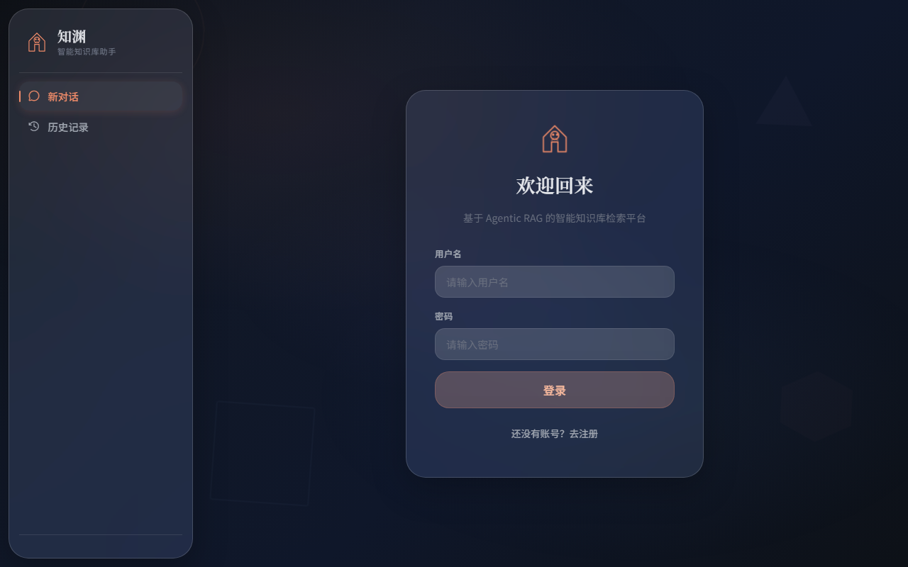
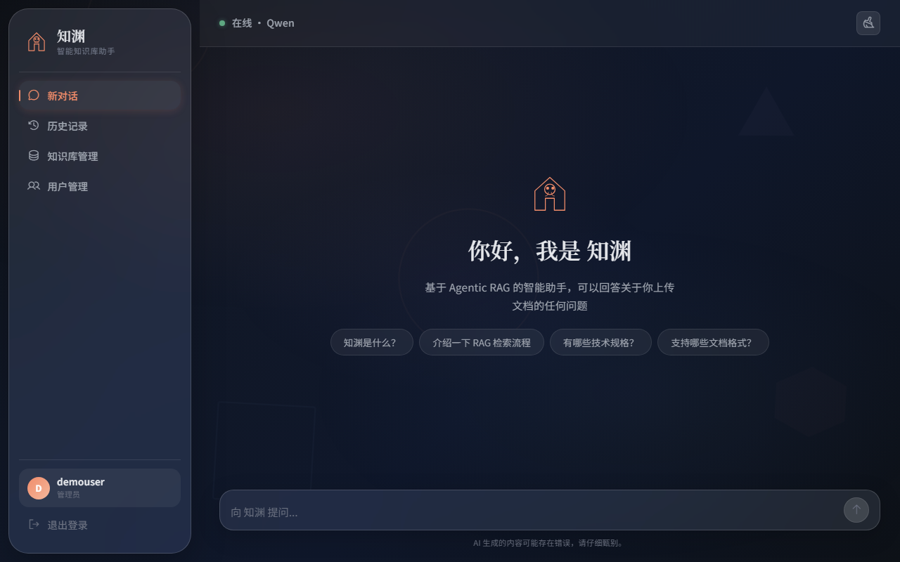
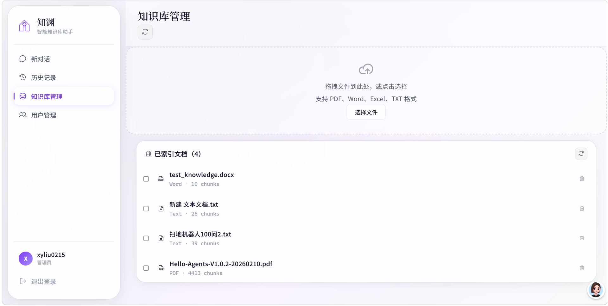
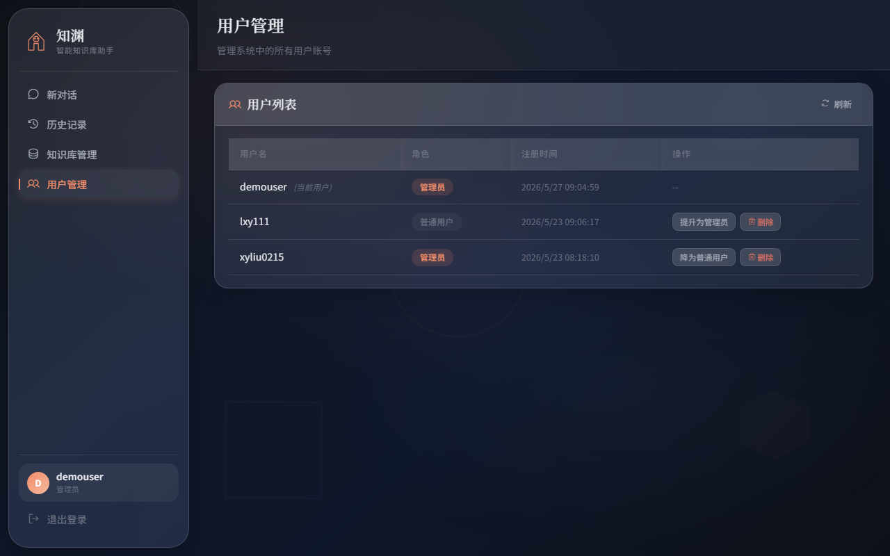

# 知渊 (ZhiYuan) — Agentic RAG 智能知识库

> **v2.0** — 自适应复杂度路由 + 并行子Agent RAG + 前端 TypeScript 化

基于 **Agentic RAG** 架构的智能知识库检索平台。上传文档后，通过混合检索与 LLM Agent 自主分析问题复杂度、拆解子问题并行检索，精准回答你的问题。

## 功能特性

### 核心 RAG（v2.0 新增）
- **🧭 自适应复杂度路由** — LLM 自动判断问题复杂度：简单问题走标准检索，复杂问题自动拆解为子问题并行检索
- **🔀 并行子Agent RAG** — 复杂问题分解为 2-4 个子问题，通过 LangGraph `Send` API 并行分发到独立子Agent，各自完成完整 RAG 流程后合成
- **📊 检索流水线优化** — 召回 → Auto-Merge 父块 → Jina Rerank 重排序 → 阈值过滤，重排器看到完整上下文而非碎片
- **🛡️ 强制 Step-Back 降级** — 检索为空时自动跳过评分，直接触发退步查询扩展，节省 LLM 调用
- **🎯 RERANK_MIN_SCORE 阈值** — 可配置的最低相关性分数，自动过滤低质量文档
- **🔧 候选池精细控制** — 支持 `RETRIEVAL_CANDIDATE_K` 显式指定检索候选数，便于调优

### 基础能力
- **多格式文档解析** — 支持 PDF、Word (.docx)、Excel (.xlsx)、TXT，自动检测编码
- **三级滑动窗口分块** — L1(1200字) / L2(600字) / L3(300字) 层级分块，叶子向量化，父级自动合并
- **混合检索** — 稠密向量 (BGE-M3) + 自实现 BM25 稀疏向量，RRF 融合排序
- **智能重排序** — Jina Reranker v3 对候选结果二次精排
- **Agent 自主规划** — LangChain Agent 驱动，自主选择检索策略、调用工具
- **查询扩展** — 检索质量不足时自动触发退步问题 / HyDE / 复杂策略重写
- **实时 Web 搜索** — 知识库无结果时自动联网补充（Tavily）
- **流式对话** — SSE 实时推送，打字机效果 + RAG 检索过程实时可视化（含子Agent分组）
- **用户认证** — JWT 登录/注册，PBKDF2-SHA256 密码哈希，管理员 + 普通用户双角色
- **文档管理** — 批量上传/删除，分步进度跟踪
- **用户管理** — 管理员可查看/删除用户、切换角色

### 前端
- **TypeScript 工程化** — Vite 5 + Vue 3 Composition API + Pinia 状态管理，29 个模块化组件
- **暗色玻璃态主题** — 渐变背景 + 浮动几何图形 + 毛玻璃卡片 UI
- **RAG 过程可视化** — 复杂度分类标签、子问题分解展示、检索漏斗统计、子Agent详情面板

## 截图展示

| 登录页 | 对话页 | 
|--------|--------|
|  |  |

| 知识库管理 | 用户管理 |
| ------------|----------|
|  |  |

## 架构概览

```
浏览器 (Vue 3 SPA) ──SSE──▶ FastAPI 后端 ──▶ LangChain Agent
                                    │              │
                                    │              ├── search_knowledge_base (RAG)
                                    │              ├── search_web (Tavily)
                                    │              └── get_weather (高德)
                                    │
                                    ├── PostgreSQL (用户/会话/父级分块)
                                    ├── Redis (缓存)
                                    └── Milvus (稠密 + 稀疏向量)
```

### RAG 管道（v2.0 双路径架构）

```
用户查询
    │
    ▼
复杂度分类 (LLM)
    │
    ├── simple ──────────────────────┐
    │                                │
    ▼                                ▼
complex                         标准 RAG 流程
    │                           retrieve_initial
    ▼                                │
子问题分解 (2-4 个)              grade_documents
    │                           │         │
    ▼                         相关      不相关
LangGraph Send API              │         │
    │                           ▼         ▼
    ├── 子Agent 1 (完整RAG)   生成回答  查询重写
    ├── 子Agent 2 (完整RAG)              │
    └── 子Agent N (完整RAG)         retrieve_expanded
    │                                      │
    ▼                                      ▼
结果合成 (去重排序)                   生成回答
    │
    ▼
生成回答
```

### 检索流水线（单次检索）

```
召回 (hybrid: dense + sparse)
    │
    ▼
Auto-Merge (L3→L2→L1 父块合并)  ← 先合并，让重排器看到完整上下文
    │
    ▼
Jina Rerank 重排序               ← 对合并后的父块打分
    │
    ▼
RERANK_MIN_SCORE 阈值过滤        ← 过滤低相关文档
    │
    ▼
返回最终文档列表
```

## 技术栈

| 层 | 技术 |
|---|------|
| 后端框架 | FastAPI + Uvicorn |
| Agent 框架 | LangChain + LangGraph |
| 大语言模型 | Qwen3-Max / Qwen3.6-Flash (DashScope) |
| 向量模型 | BAAI/bge-m3 (1024维) |
| 向量数据库 | Milvus 2.5 (HNSW + 稀疏倒排索引) |
| 关系数据库 | PostgreSQL 15 |
| 缓存 | Redis 7 |
| 重排序 | Jina Reranker v3 |
| 前端 | Vue 3 + TypeScript + Vite + Pinia + Phosphor Icons + marked + highlight.js |
| 容器化 | Docker Compose |

## 快速开始

### 1. 克隆项目

```bash
git clone https://github.com/LXY666-bit/ZhiYuan.git
cd ZhiYuan
```

### 2. 配置环境变量

```bash
cp .env.example .env
```

编辑 `.env`，填入你的 API 密钥：

- `ARK_API_KEY` — [阿里云 DashScope](https://dashscope.console.aliyun.com/apiKey)
- `RERANK_API_KEY` — [Jina AI](https://jina.ai/)
- `TAVILY_API_KEY` — [Tavily](https://tavily.com/)（网页搜索用，可选）
- `AMAP_API_KEY` — [高德开放平台](https://lbs.amap.com/)（天气查询用，可选）

### 3. 安装依赖

本项目使用 [uv](https://docs.astral.sh/uv/) 管理 Python 依赖：

```bash
uv sync
```

### 4. 启动基础设施

```bash
docker-compose up -d
```

这会启动 PostgreSQL、Redis、Milvus、etcd、MinIO。首次下载镜像需要几分钟。

### 5. 启动后端

```bash
uv run uvicorn backend.app:app --host 0.0.0.0 --port 8000 --reload
```

### 6. 启动前端

```bash
cd frontend
npm install
npm run dev
```

前端开发服务器运行在 **http://localhost:3000**，API 请求自动代理到后端 8000 端口。

> 生产环境可运行 `npm run build`，将静态文件输出到 `frontend/dist/`，由 Nginx 或 FastAPI 直接托管。

### 7. 注册管理员

1. 前端页面选择"注册"
2. 角色选"管理员"
3. 填入 `.env` 中设置的 `ADMIN_INVITE_CODE`
4. 登录后即可上传文档、管理用户

## 项目结构

```
ZhiYuan/
├── backend/
│   ├── app.py                  # FastAPI 入口 + 中间件配置
│   ├── core/                   # 基础设施层
│   │   ├── database.py         # SQLAlchemy 引擎 + 会话工厂
│   │   ├── cache.py            # Redis 缓存封装
│   │   ├── auth.py             # JWT 认证 + 密码哈希
│   │   ├── models.py           # SQLAlchemy ORM 模型
│   │   └── schemas.py          # Pydantic 请求/响应模型
│   ├── vectorstore/            # 向量存储层
│   │   ├── embedding.py        # BGE-M3 稠密 + BM25 稀疏向量
│   │   ├── milvus_client.py    # Milvus 连接与混合检索
│   │   ├── milvus_writer.py    # 向量批量写入
│   │   └── parent_chunk_store.py  # 父级分块 PostgreSQL 存储
│   ├── rag/                    # RAG 检索层
│   │   ├── document_loader.py  # 文档解析 + 三级分块
│   │   ├── rag_pipeline.py     # LangGraph RAG 管道（复杂度路由 + 并行子Agent）
│   │   └── rag_utils.py        # 检索/重排序/自动合并/查询扩展
│   ├── agent/                  # Agent 智能体层
│   │   ├── agent.py            # LangChain Agent + 对话存储
│   │   └── tools.py            # Agent 工具（知识库/网络/天气）
│   └── api/                    # API 路由层
│       ├── routes.py           # REST API 路由
│       └── upload_jobs.py      # 上传/删除任务进度管理
├── frontend/
│   ├── src/
│   │   ├── main.ts               # Vue 3 入口
│   │   ├── App.vue               # 根组件
│   │   ├── components/
│   │   │   ├── AuthPanel.vue     # 登录/注册面板
│   │   │   ├── Sidebar.vue       # 侧边导航
│   │   │   ├── Chat/             # 聊天相关组件
│   │   │   │   ├── ChatArea.vue
│   │   │   │   ├── ChatInput.vue
│   │   │   │   ├── MessageItem.vue
│   │   │   │   ├── MessageContent.vue
│   │   │   │   ├── ThinkingTrace.vue
│   │   │   │   ├── References.vue
│   │   │   │   ├── WebSources.vue
│   │   │   │   └── WelcomeScreen.vue
│   │   │   ├── Documents/        # 文档管理组件
│   │   │   ├── Users/            # 用户管理组件
│   │   │   └── HistorySidebar.vue
│   │   ├── stores/               # Pinia 状态管理
│   │   ├── types/                # TypeScript 类型定义
│   │   ├── utils/                # 工具函数 (API/Markdown)
│   │   └── assets/styles/        # 全局样式
│   ├── package.json              # 前端依赖
│   ├── vite.config.ts            # Vite 配置 + API 代理
│   └── tsconfig.json             # TypeScript 配置
├── docker-compose.yml      # PostgreSQL + Redis + Milvus + etcd + MinIO
├── pyproject.toml          # Python 依赖
├── .env.example            # 环境变量模板
└── README.md
```

## API 端点

### 认证
| 方法 | 路径 | 说明 |
|------|------|------|
| POST | `/auth/register` | 注册 |
| POST | `/auth/login` | 登录 |
| GET | `/auth/me` | 当前用户信息 |

### 聊天
| 方法 | 路径 | 说明 |
|------|------|------|
| POST | `/chat` | 非流式对话 |
| POST | `/chat/stream` | SSE 流式对话 |

### 文档管理（管理员）
| 方法 | 路径 | 说明 |
|------|------|------|
| GET | `/documents` | 文档列表 |
| POST | `/documents/upload/async` | 异步上传 |
| DELETE | `/documents/delete/async/{name}` | 异步删除 |

### 用户管理（管理员）
| 方法 | 路径 | 说明 |
|------|------|------|
| GET | `/users` | 用户列表 |
| DELETE | `/users/{username}` | 删除用户 |
| PUT | `/users/{username}/role` | 修改角色 |

## 更新日志

### v2.0 (2026-06)

**RAG 管道升级：**
- 新增自适应问题复杂度路由（LLM 自动判断简单/复杂）
- 新增并行子Agent RAG（LangGraph `Send` API，复杂问题自动拆解并行检索）
- 检索流水线顺序优化：**召回 → Auto-Merge → Rerank → 阈值过滤**（重排器看到完整父块）
- 新增 `RERANK_MIN_SCORE` 阈值过滤
- 新增强制 Step-Back 降级（检索为空跳过评分）
- 新增 `RETRIEVAL_CANDIDATE_K` 候选池显式控制
- 独立封装 `dedupe_documents()` 去重 + `merge_retrieval_trace()` 多路trace合并
- 子问题分解关键词兜底（模型误判时自动修正）

**前端 TypeScript 化：**
- CDN 方案 → Vite 5 + Vue 3 Composition API + TypeScript strict
- 单体 script.js → Pinia 4 stores（auth / chat / sessions / documents）
- 3 个文件 → 29 个模块化组件
- 新增复杂度分类 Banner、子问题列表、检索漏斗统计、子Agent详情面板
- RAG 步骤实时分组展示（并行子Agent每条路独立显示）

**基础设施：**
- 新增 `FAST_MODEL` 配置项（复杂度分类/子问题分解用）
- 新增 `AUTO_MERGE_ENABLED` / `AUTO_MERGE_THRESHOLD` 环境变量

### v1.0 (2026-02)

- 多格式文档解析 + 三级滑动窗口分块
- 混合检索（BGE-M3 + 自实现BM25）+ Jina Reranker
- LangChain Agent + LangGraph RAG 管道
- SSE 流式对话 + RAG 过程可视化
- JWT 认证 + 用户管理 + 文档管理
- 暗色玻璃态主题

## License

MIT
